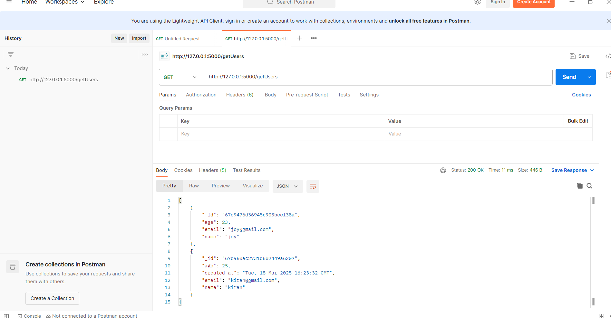
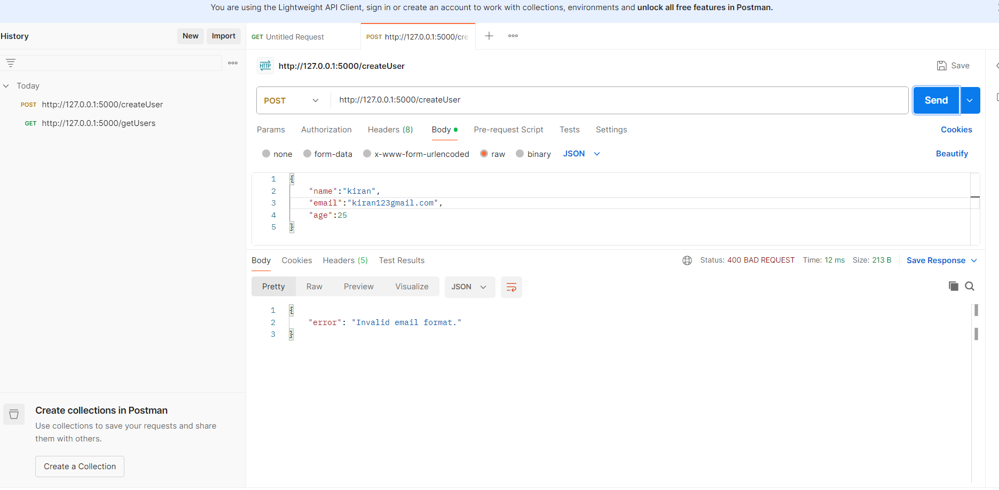
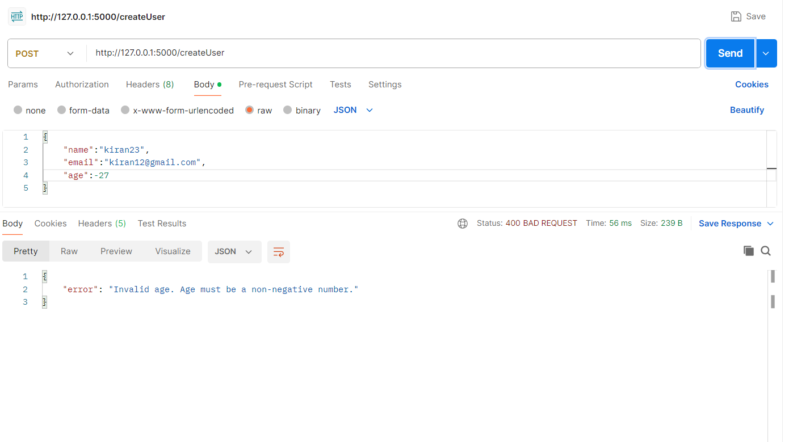
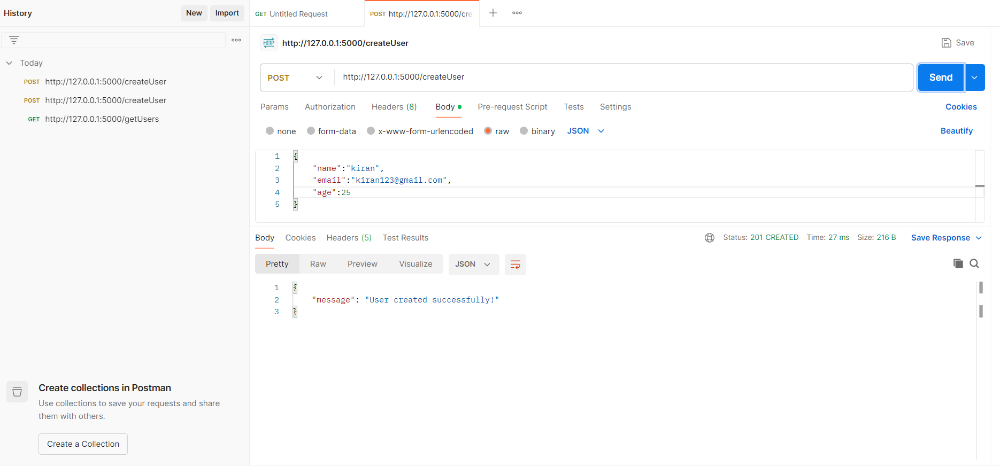
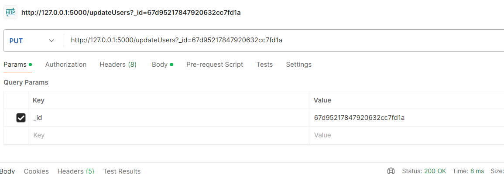
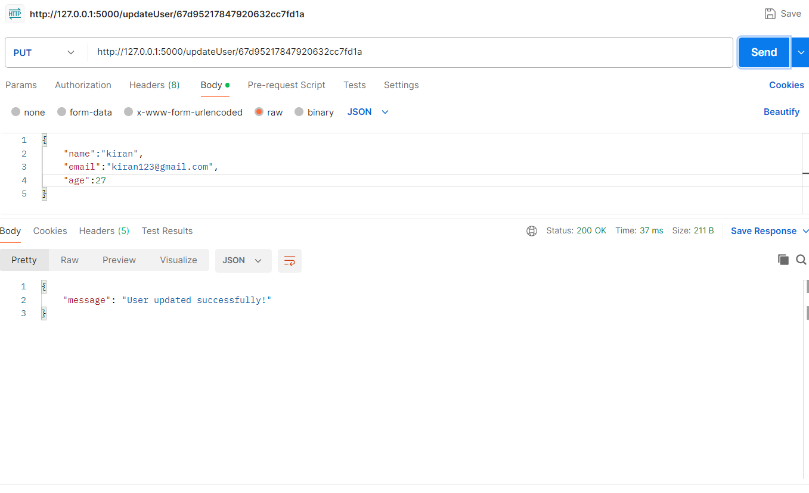
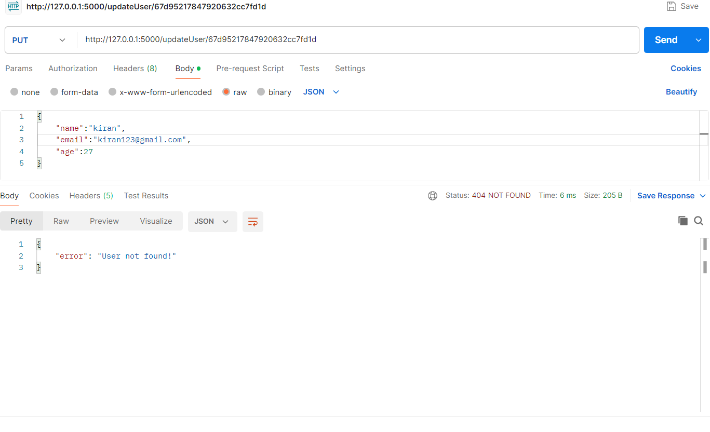
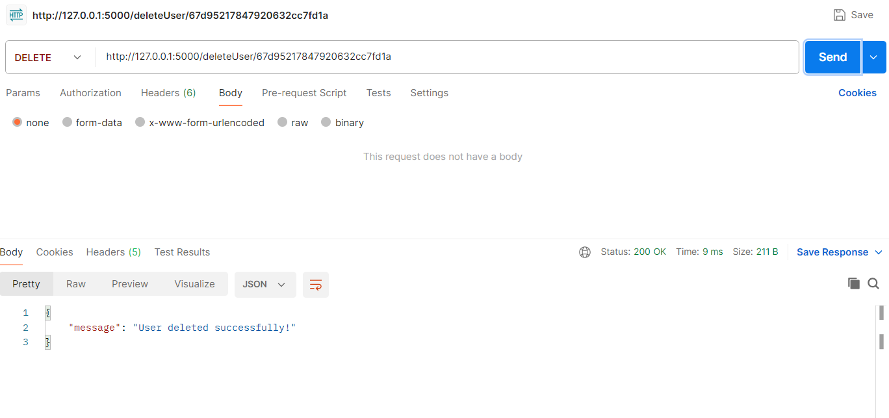
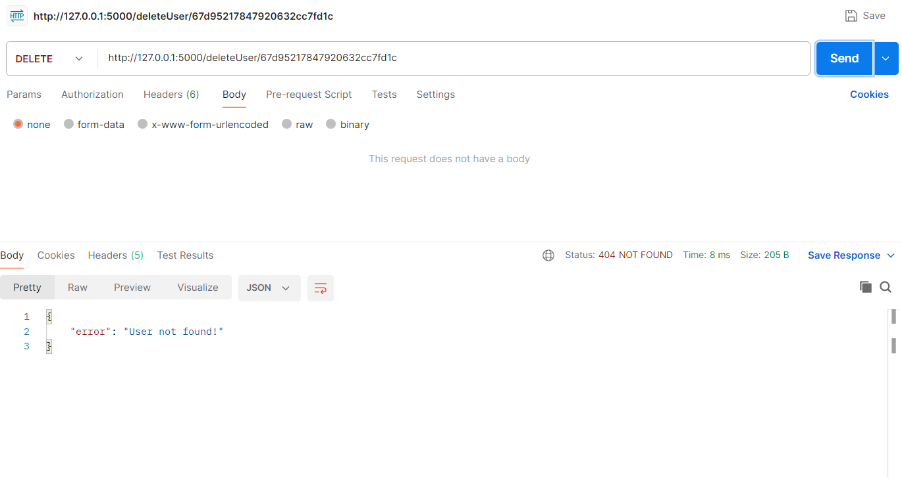

# backend-flask
# Flask MongoDB API

This is a simple RESTful API built using Flask and MongoDB, allowing users to create, read, update, and delete (CRUD) user data.

## Features
- Connects Flask with MongoDB
- Handles user creation with email and age validation
- Supports fetching all users
- Allows updating user details
- Provides user deletion functionality

## Setup Instructions

### Prerequisites
Ensure you have the following installed:
- Python (>=3.7)
- MongoDB (running locally or on a server)
- Flask and dependencies

### Installation
1. Clone the repository:
   
   git clone https://github.com/tarakakiranmayi/backend-flask.git
   cd backend-flask
   

2. Create a virtual environment (optional but recommended):
   
   python -m venv venv
   source venv/bin/activate  # On Windows: venv\Scripts\activate
   

3. Install dependencies:
   
   pip install -r requirements.txt
   

4. Ensure MongoDB is running:
   
   mongod --dbpath /path/to/mongodb/data
   

5. Run the Flask application:
   
   python app.py
   
   The server will start at http://127.0.0.1:5000

## API Endpoints Documentation

### 1. Home
- Endpoint: /
- Method: GET
- Description: Check if the server is running
- Response:
  json
  "Hello, Flask is running!"
  

### 2. Create a User
- Endpoint: /createUser
- Method: POST
- Description: Creates a new user with email and age validation
- Request Body (JSON):
  
  {
    "name": "John Doe",
    "email": "johndoe@gmail.com",
    "age": 25
  }
  
- Response:

  { "message": "User created successfully!" }
  

### 3. Get All Users
- Endpoint: /getUsers
- Method: GET
- Description: Fetch all users from the database
- Response:

  [
    {
      "_id": "6123456789abcdef01234567",
      "name": "John Doe",
      "email": "johndoe@gmail.com",
      "age": 25,
      "created_at": "2024-09-12T10:00:00"
    }
  ]
  

### 4. Update User
- Endpoint: /updateUser/<id>
- Method: PUT
- Description: Update a user’s details using their ID
- Request Body (JSON):
  {
    "name": "John Smith",
     "email":  "johndoe@gmail.com"
    "age": 30
  }
  
- Response:
  json
  "User updated successfully!"
  

### 5. Delete User
- Endpoint: /deleteUser/<id>
- Method: DELETE
- Description: Delete a user from the database using their ID
- Response:
  "User deleted successfully!"
  
## Sample Requests & Responses

## Demo Video
<figure class="video_container">
  <iframe src="https://github.com/tarakakiranmayi/backend-flask/blob/main/backend%20video%20-%20Made%20with%20Clipchamp.mp4" frameborder="0" allowfullscreen="true"> 
</iframe>
</figure>
📽️ Demo Video:(https://github.com/tarakakiranmayi/backend-flask/blob/main/backend%20video%20-%20Made%20with%20Clipchamp.mp4)

## Author
- Your Name
- GitHub: https://github.com/tarakakiranmayi

## License
This project is open-source and available under the MIT License.

